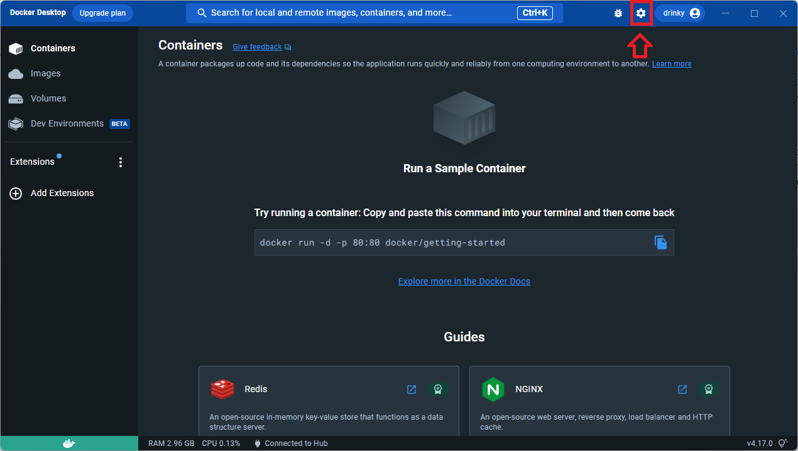

# WebAssembly + Docker

WebAssembly konteinerid on üks kõige uuemaid trende pilvetehnoloogias. Järgnevas õpetuses katsetame uut laadi konteineri püstitada ning ise ehitada, seletades järk-järgult erinevusi ja eeliseid.

# Paigaldus

## Ettevalmistus

1. Paigalda ja tee lahti [Docker Desktop](https://www.docker.com/products/docker-desktop/)

2. Lülita sisse uue WebAssembly konteineri toetused (vt pildid)

NB! Tehnoloogia uudsuse tõttu võib teine samm olla ebavajalik, kuna siin me lülitame sisse Beta funktsiooni, mis tulevikus on suure tõenäosusega avaldatud kõigile.




Docker on nüüd valmis käsitlema WebAssembly konteinerid. Arvuti restart ei ole vajalik.

## Kiire katsetus
Paigaldame läbi käsurea ametliku WebAssembly konteineri näidise.

1. Terminalis sisesta järgmise käsu:

```bash
docker run -dp 8080:8080 \
  --name=wasm-example \
  --runtime=io.containerd.wasmedge.v1 \
  --platform=wasi/wasm32 \
  michaelirwin244/wasm-example
```
Antud käsk koostab ja käivitab uue veebiteenuse, mis hakkab elama arvutis 8080 portis.

- `--name=wasm-example` kirjeldab konteineri nime.
- `--runtime=io.containerd.wasmedge.v1` ütleb Dockerile, et tahetakse kasutada WebAssembly käivituskeskkonna. Vaikimisi kaustatakse Linux konteineri.
- `--platform=wasi/wasm32` ütleb, mis platformi väljastatud teenus sihib. 
- `michaelirwin244/wasm-example` on ametlik WASM konteineri näidis, mida tõmmatakse [Docker Hubist](https://hub.docker.com/r/michaelirwin244/wasm-example).

2. Lähme brauseris `localhost:8080` aadressile.

Kõik on õige, kui saab aadressilt vastuse!

Teenuse taga jookseb Rustis kirjutatud veebiserver, mida kompileeriti WebAssemblisse. Serveeritud lehekülg on järgneva veebiserveri vastus. Nii saab tekitada lihtsad ja skaleerituvad mikroteenused WebAssembly konteineritena.

Teenuse lõpetamiseks käivita järgmise käsu käsurealt:

```bash
docker stop wasm-example
```

# Ehitame ise konteineri

Järgnevas peatükis ehitame täiesti eraldiseisva WebAssembly konteineri, mis käivitab lihtsa Rustis kirjutatud WebAssembly mooduli.

Koodi kirjutamiseks saab kasutada oma soovitud koodiredaktoriks. Kui seda ei ole, siis soovitusena saab kasutada [Visual Studio Code](https://code.visualstudio.com/) koos [rust-analyzer](https://marketplace.visualstudio.com/items?itemName=rust-lang.rust-analyzer) laiendiga.

## Rusti paigaldus

Rusti on võimalik paigaldada Linuxil, Windowsil ja Macil. Windowsil on võimalik 

Windows, Linuxi ja Maci kõige värskemad paigaldusjuhendid asuvad [siin](https://www.rust-lang.org/tools/install).

### Linux või Windows (WSL)
Linuxiga või WSL-iga saab paigaldada järgmise terminali käsuga (Windows Subsystem for Linux):

```bash
curl --proto '=https' --tlsv1.2 -sSf https://sh.rustup.rs | sh
```

Uuenda süsteemi `$PATH` muutuja, et Rusti tööriistad töötaksid olevas terminalis.

```bash
source "$HOME/.cargo/env"
```

Seejärel veendu, et Rust on paigaldatud:

```bash
rustc --version
```

Installeerime WebAssembly käivituskeskkonna sihi (runtime target), et saaks rakenduse hiljem kompileerida WebAssembly koodiks.
```bash
rustup target add wasm32-wasi
```

## WebAssembly rakendus Dockeris

### Koostame uue Rust projekti


1. Tekitame uue Rusti projekti

Projekti tekitamiseks jaoks kasutame `cargo` pakettihaldajat.

```bash
cargo new docker-wasm
```

2. Lähme tekitatud kataloogi sisse
```
cd docker-wasm
```
3. Muudame **src/main.rs** faili.

Siin väga palju ei muuda - kirjutame väljundiks soovitud teksti:

```rust
fn main() {
    println!("Tere läbi Dockeri!");
}
```

4. Kompileerime ja käivitame

```bash
cargo build && ./target/debug/docker-wasm
```

5. Kompileerime WebAssembliks
```bash
cargo build --target wasm32-wasi
```

### Docker konteiner

Siin me koostame Docker konteineri, mis jooksutab meie näidisrakenduse. Siin toimub kõik standardselt ja sarnaselt tavalise Docker konteineri koostamisel.

1. Tekitame Dockerfile-i

```docker
FROM scratch
COPY ./target/wasm32-wasi/debug/docker-wasm.wasm /docker-wasm.wasm
ENTRYPOINT [ "docker-wasm.wasm" ]
```

Seletus:

`FROM scratch` - **scratch** on reserveeritud Dockeri võtmesõna, mis ütleb, et alustame konteineri nullist. Traditsiooniliselt siin oleks võimalik kasutada näiteks **ubuntu** või **openjdk** Java rakenduste jaoks, kuid siin me teeme täiesti minimaalse WebAssembly konteineri.

`COPY ./target/wasm32-wasi/debug/docker-wasm.wasm /docker-wasm.wasm` - kopeerime meie kompileeritud .wasm failid konteinerisse.

`ENTRYPOINT [ "docker-wasm.wasm" ]` - see ütleb, et konteineri käivitamisel pannakse käima meie .wasm faili. 

Siin nüüd leidub esimene erinevus tavaliste Docker konteineritega võrreldes - tavaliselt selle .wasm faili ei oleks võimalik niisama käivitada.

2. Ehitame konteineri

```bash
docker build -name docker-wasm --platform wasi/wasm32 -t hello-wasm .
```

Siin leidub teine erinevus: Me ütleme Dockerile, et selle konteineri käivitusplatform on WebAssembly.

3. Jooksutame konteineri

```bash
docker run --runtime=io.containerd.wasmedge.v1 --platform=wasi/wasm32 docker-wasm
```

Lõpuks tuleb välja ka kolmas erinevus: Siin määrame nii käivituskeskkonna kui ka käivitusplatformi. Selle eelis on see, et iga platformi jaoks (x86, arm jne) ei ole vaja eraldi ehitada eraldiseisva konteineri. See tähendab, et jagatud konteineri saab jooksutada nii traditsioonilise x86 protsessoriga Windowsis, Linuxis ja Macis, uutes Apple Silicon Mac masinates ja ka näiteks Raspberry Pi mikromasinates.

Väljundiks peaks tulema eelnevas peatükkis kirjutatud sõnum. Õpetuse juhul:

```
Tere läbi Dockeri!
```

## Kokkuvõtte

See oli lihtne näide, kuid ideaalis on WebAssembly konteinerid väiksed mikroteenused, mis ka päriselt teevad midagi - kasvõi veebiteenusena. Selleks peaks kasutusele võtma Rustis kirjuattud reaalse HTTP serveri sõltuvusi (või ise kirjutama), et seda ka saavutada.

Kui käivitad järgmise käsu:

```bash
docker image ls
```
Siin võib märgata meie konteineri väikse suuruse. Paigalduse käigul katsetatud ametlik näide on ainult poolteist megabaiti. Enda ehitatud väike näide on natuke üle megabaiti. Kui juhuslikult juba olid mõned Dockeri teenused paigaldatud, siis enamus neist on üle 100 megabaiti. Võrdluseks võib tuua `node-alpine` konteineri, mis on minifitseeritud NodeJs-iga konteiner - ta on ikkagi üle 100 megabaiti.

Kuna tegemist on Dockeriga, siis mängu saab tulla ka **docker compose**, et kombineerida mitu teenust kokku.

Näiteks, samalaadne ametlik konteineri näide `docker-compose.yaml` failina, kuhu on võimalik panna kõrvale näiteks andmebaasi teenuse:

```yaml
services:
  app:
    image: michaelirwin244/wasm-example
    platform: wasi/wasm32
    runtime: io.containerd.wasmedge.v1
    ports:
      - 8080:8080
```

# Huvilistele

Uuri lähtekoodi, kuidas püstitati Rusti baasil lihtsa HTTP serveri ja serveeriti masinõppe mudeli:
- https://github.com/WasmEdge/wasmedge_hyper_demo

# Allikad

Materjal loodud järgnevate allikate põhjal:

- https://docs.docker.com/desktop/wasm/
- https://blog.devgenius.io/wasm-docker-hello-world-2ac6a456ddd4